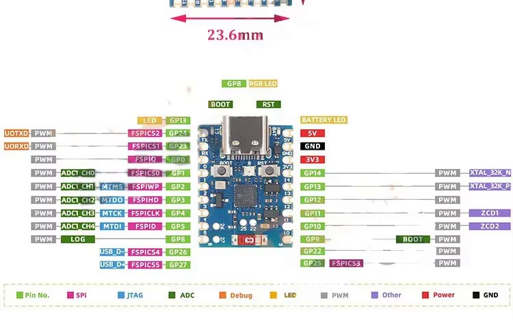
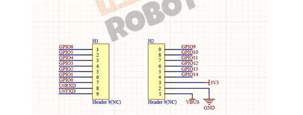
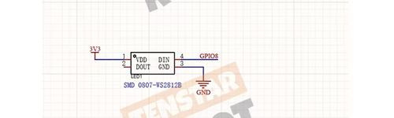
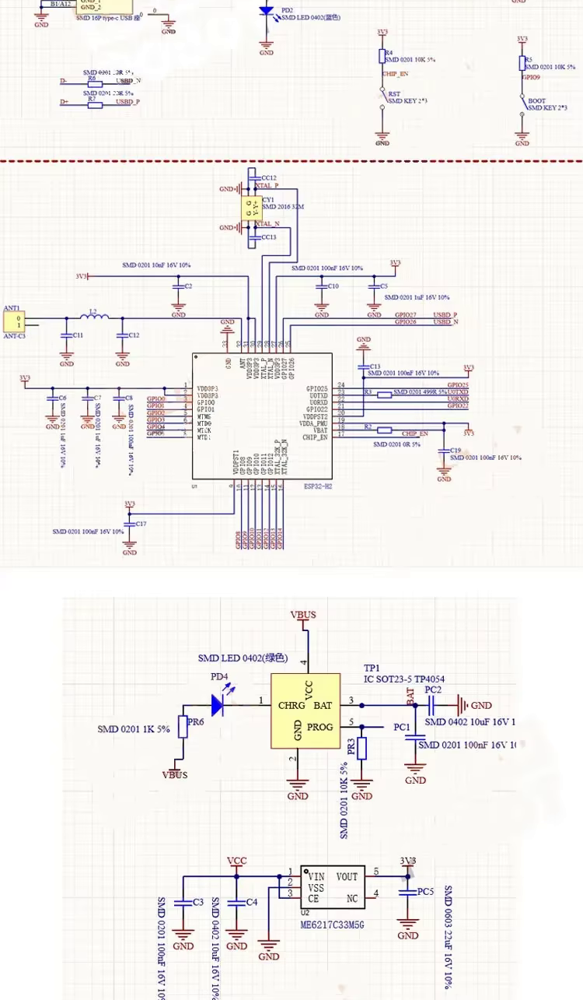
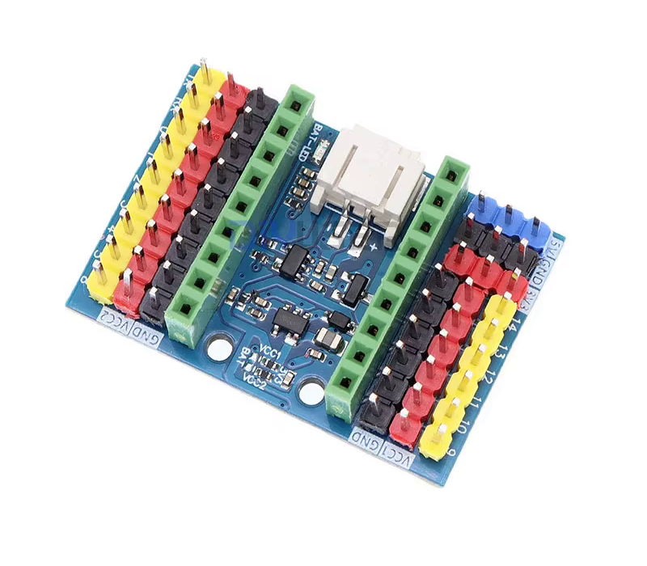

# Hardware: Módulo ESP32-H2, Pinout y Desacople de GPIO

## 1. Módulo ESP32-H2 "Supermini" (referencia física)

Diagrama de catálogo (marketing) de un módulo ESP32-H2 en formato "Supermini" (23.6 x 18 mm,
USB-C, botones BOOT/RST). Este diagrama muestra las capacidades alternativas de CADA GPIO del
chip (SPI/JTAG/ADC/PWM), no necesariamente qué pines trae soldados el header físico de esta
placa concreta - para eso usa el esquemático de conector de abajo, que es la fuente autoritativa.

### Esquemático de conector (fuente autoritativa - úsalo para cablear)

A diferencia del diagrama de catálogo de arriba (que es una pieza de marketing), este es el
**esquemático eléctrico real del conector** - 18 pines en total repartidos en dos headers de 9:

| Header H1 (pin → señal) | Header H2 (pin → señal) |
|---|---|
| 1 → GPIO8 | 9 → GPIO9 |
| 2 → GPIO5 | 8 → GPIO10 |
| 3 → GPIO4 | 7 → GPIO11 |
| 4 → GPIO3 | 6 → GPIO12 |
| 5 → GPIO2 | 5 → GPIO13 |
| 6 → GPIO1 | 4 → GPIO14 |
| 7 → GPIO0 | 3 → 3V3 |
| 8 → U0RXD (= GPIO23 en modo UART0 RX) | 2 → VBUS |
| 9 → U0TXD (= GPIO24 en modo UART0 TX) | 1 → GND |

**Solo 15 GPIO de usuario existen en este módulo en total**: `0,1,2,3,4,5,8,9,10,11,12,13,14,23,24`.
**GPIO6, GPIO7, GPIO15, GPIO22 y GPIO25 NO están disponibles en ningún header ni pad** - la
suposición inicial de que GPIO22 era un "pad de soldadura libre" (basada solo en el diagrama de
catálogo) era incorrecta; este esquemático de conector no lo incluye en absoluto.

### LED RGB integrado (WS2812B) - comparte GPIO8

El módulo trae un LED RGB direccionable (WS2812B) soldado de fábrica, con su `DIN` cableado
internamente a **GPIO8** - el mismo pin que este proyecto usa para `PIN_TOUCH_SDA`. El firmware
no controla ese LED, así que no hay conflicto funcional en la práctica, pero queda documentado
por si en el futuro se quiere usar el LED integrado como indicador de estado (en ese caso SÍ
competiría con el bus I2C del táctil).

### ✅ Conflicto con el pinout original - resuelto

Con solo 15 GPIO disponibles en total, y el proyecto necesitando 15 funciones distintas
(bombas, sensores de corriente, sensor de nivel, batería, 6 señales de pantalla, 4 de táctil),
**no sobra un tercer pin nuevo** para reemplazar los tres originalmente en conflicto
(GPIO6/7/15). La resolución no es solo "mover pines" sino también **eliminar la necesidad de
uno de ellos**:

| Función | Pin original | Resolución | Motivo |
|---------|:---:|---|---|
| `TFT_CS` / `PIN_LCD_CS` | GPIO7 | **Atado a GND permanentemente** (`TFT_CS=-1`) | Único dispositivo en el bus SPI - no necesita selección activa, así que no requiere GPIO en absoluto |
| `TFT_DC` / `PIN_LCD_DC` | GPIO6 | **GPIO24** (pin "TX"/U0TXD) | Único pin nuevo realmente disponible |
| `PIN_TOUCH_RST` | GPIO15 | **GPIO23** (pin "RX"/U0RXD) | Liberado al quitarle el GPIO a TFT_CS |

GPIO23/24 son el UART0 físico y quedan libres porque este proyecto usa USB-CDC nativo para
`Serial` (`ARDUINO_USB_CDC_ON_BOOT=1`), no el UART físico - reutilizarlos como GPIO de propósito
general no interfiere con el Monitor Serie.

Ya aplicado en `platformio.ini` (`TFT_CS=-1`, `TFT_DC=24`) y `src/Config.h`
(`PIN_TOUCH_RST=23`) - ver también la tabla actualizada en [`PINOUT.md`](../../PINOUT.md).

**Pendiente de tu confirmación física**: verifica con multímetro/continuidad que tu unidad
concreta coincide con este esquemático antes de soldar. El vendedor (TENSTAR ROBOT en
AliExpress) también ofrece una variante de breakout **"Expansion B For H2"** específica para
este módulo - si la tienes, probablemente ya tenga estos pines accesibles en su propio
conector y sería preferible usarla en vez del breakout genérico de 16 canales de la sección 2
(no se pudo confirmar su distribución exacta de pines en esta sesión).

### Esquemático interno (USB-C, oscilador, MCU, carga de batería)

De arriba a abajo: (1) conector USB-C con líneas D+/D-, botones BOOT/RST y LED de estado;
(2) oscilador de 32MHz y el propio ESP32-H2 con sus GPIO de fábrica (GPIO0-3, MTMS/MTDO/MCLK
para JTAG, XTAL_32K); (3) circuito de carga de batería vía TP4054 (`CHRG`/`BAT`/`PROG`) y
regulador LDO 3.3V `ME6217C33M5G`. Útil como referencia si necesitas verificar continuidad o
diagnosticar alimentación/carga, pero es información del **módulo comprado**, no del cableado
de este proyecto (bombas, sensor de nivel, pantalla) descrito en `PINOUT.md`.

## 2. Breakout de terminales de tornillo (accesorio de cableado)

Foto de catálogo de un **breakout de terminales de tornillo de 16 canales**, un accesorio
distinto del módulo de la sección 1, usado para llevar señales a bornes atornillables en vez
de headers de pines sueltos. Cada canal expone un trío de pines **señal (amarillo) / VCC (rojo)
/ GND (negro)**, numerados **0 a 15**. Además trae dos rieles de alimentación auxiliares
(`VCC1/GND`, `VCC2/GND`) y un conector `BAT-LED` de 2 pines, coherente con la batería 18650 +
cargador (TP4056/CN3163) y el LED de estado que ya se documentan en `PINOUT.md`.

### Correlación propuesta canal → GPIO → función

> **Nota de fidelidad**: la placa es genérica y no serigrafía el nombre de cada función - solo
> el número de canal (0-15). La correlación de abajo es una **inferencia**, no un dato extraído
> directamente de la imagen: se apoya en que el proyecto usa (mayormente) el rango GPIO0-GPIO15,
> así que el mapeo más simple es *canal N del breakout = GPIO N*. Verifica con
> multímetro/continuidad antes de dar por buena esta correlación en una placa física.
>
> **Dos funciones quedan FUERA de este breakout genérico**: `LCD_DC` (GPIO24) y `Touch RST`
> (GPIO23) se remapearon fuera del rango 0-15 (ver sección 1) porque el módulo "Supermini" no
> expone GPIO6/15 - y este breakout de 16 canales tampoco tiene terminales para GPIO23/24.
> `LCD_CS` ya no necesita ningún pin (atado a GND). Esas dos señales deben cablearse
> **directamente** desde el header del módulo (pines "TX" y "RX") sin pasar por este accesorio.

| Canal | GPIO | Función | Definido en |
|:-----:|:----:|---------|-------------|
| 0  | GPIO0  | Bomba A - MOSFET Canal A | `PIN_PUMP_A` (Config.h) |
| 1  | GPIO1  | Bomba B - MOSFET Canal B | `PIN_PUMP_B` (Config.h) |
| 2  | GPIO2  | Bomba A - sensor de corriente (ACS712) | `PIN_PUMP_A_ISENSE` (Config.h) |
| 3  | GPIO3  | Bomba B - sensor de corriente (ACS712) | `PIN_PUMP_B_ISENSE` (Config.h) |
| 4  | GPIO4  | LCD Backlight (brillo, PWM opcional) | `PIN_LCD_BL` (Config.h) / `TFT_BL` (platformio.ini) |
| 5  | GPIO5  | LCD Reset | `PIN_LCD_RST` (Config.h) / `TFT_RST` (platformio.ini) |
| 8  | GPIO8  | Touch SDA (I2C) | `PIN_TOUCH_SDA` (Config.h) |
| 9  | GPIO9  | Touch SCL (I2C) | `PIN_TOUCH_SCL` (Config.h) |
| 10 | GPIO10 | Batería - entrada ADC | `PIN_BATTERY` (Config.h) |
| 11 | GPIO11 | Sensor de nivel (flotador, INPUT_PULLUP) | `PIN_LEVEL_SENS` (Config.h) |
| 12 | GPIO12 | LCD SCLK | `PIN_LCD_SCLK` (Config.h) / `TFT_SCLK` (platformio.ini) |
| 13 | GPIO13 | LCD MOSI | `PIN_LCD_MOSI` (Config.h) / `TFT_MOSI` (platformio.ini) |
| 14 | GPIO14 | Touch INT (activo BAJO) | `PIN_TOUCH_INT` (Config.h) |
| **—** | **Atado a GND** | LCD Chip Select (sin GPIO - único dispositivo SPI) | `PIN_LCD_CS` (Config.h) / `TFT_CS=-1` (platformio.ini) |
| **—** | **GPIO24** | LCD Data/Command (⚠️ fuera de este breakout - pin "TX"/U0TXD del módulo) | `PIN_LCD_DC` (Config.h) / `TFT_DC` (platformio.ini) |
| **—** | **GPIO23** | Touch RST (⚠️ fuera de este breakout - pin "RX"/U0RXD del módulo) | `PIN_TOUCH_RST` (Config.h) |

`VCC1/GND`, `VCC2/GND` → rieles de 3.3V/GND para alimentar los periféricos (pantalla, táctil,
sensor). `BAT-LED` → conector de la batería 18650 con LED de estado de carga.

## 3. Por qué el código ya está (mayormente) desacoplado de estos números

Todas las funciones de `PIN_PUMP_*`, `PIN_LEVEL_SENS`, `PIN_BATTERY` y `PIN_TOUCH_*` viven como
`#define` en `src/Config.h` y el resto del firmware (`HardwareControl.cpp`, `DisplayHandler.cpp`,
`main.cpp`) solo referencia esos nombres - nunca un número de GPIO suelto. Mover, por ejemplo,
la Bomba A del canal 0 al canal 2 del breakout es cambiar una sola línea en `Config.h`.

La única excepción real son los pines SPI de la pantalla (`TFT_CS/DC/RST/MOSI/SCLK/BL`): la
librería `TFT_eSPI` los exige como `build_flags` en `platformio.ini` en tiempo de compilación y
no acepta configurarlos desde un header del proyecto. `Config.h` expone alias con nombre propio
(`PIN_LCD_CS`, etc.) para que el código de aplicación no repita las macros genéricas de la
librería, pero si cambias uno de esos pines físicamente, tienes que actualizar **ambos**
lugares: `platformio.ini` (obligatorio para que compile) y el comentario en `Config.h`.
